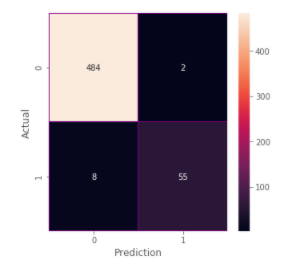
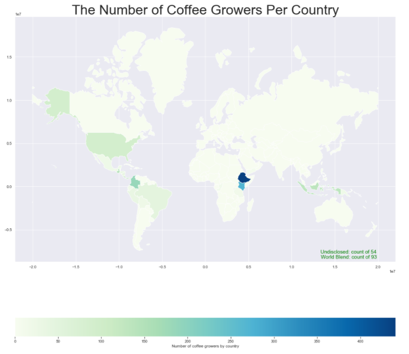

# Finding the Perfect Cup of Coffee

## Project Movitation
 
A hot cup of coffee is a pretty wonderful way to start my day. It’s a small slice of heaven in a crazy, unpredictable world. Wouldn’t it be great to know what makes a cup of coffee <i>sublime</i> so as to never be disappointed?  Therein lies the beauty of machine learning to be able to figure out what features makes a coffee great (highly rated) and stand out from the crowd. This is useful information on a personal level and can also be used by coffee shops, baristas, restuarants and other coffee enthusiasts.

## Data Source

Coffee is the second most consumed beverage IN THE WORLD (behind tea, but ahead of soda and beer), at a rate of about 2.25 billion cups a day (https://www.statista.com/statistics/292595/global-coffee-consumption/).  There are a variety of factors that make up the differences between coffee beans.  A non-exhaustive list of factors includes:
 - Ratings for aroma, acidity, flavor, aftertaste, body, 
 - Agtron score (an agtron machine reflects light on a sample of coffee to objectively assign a number for roast color)  
 - price
 - coffee bean origin
 - roaster location
 - altitude
 - roast level
 
The dataset for my work was sourced and scraped by me from the website www.coffeereviews.com. 
 

## Methodology

The OSEMN (Obtain, Scrub, Explore, Model, iNterpret) framework was followed for this project.  Data was scraped using BeautifulSoup and cleaned using pandas, NumPy and regex.  Visualizations were created using Matplotlib, Seaborn, Geopandas and Dash.  Machine learning (supervised) models were created using scikit-learn's logistic regression, random forest, random forest with SMOTE and GridSearchCV, and xgboost.  Additionally, neural network models using MLP were created to corroborate the findings from the one-layer classification models.  Interpretaion was completed by using the feature importance function returned by the model.  The results from feature importance - the top 6 features contributing to highly rated coffee beans - can be used by individual coffee drinkers wanting knowledge about the product they consume, by restuarants and coffee bars wanting the knowledge so as to serve coffee that is pleasing to their customers and for roasters, growers, distributors and buyers interested in navigating a highly lucrative industry into the 21st century with new environmental and social issues arising.

## Findings

Five thousand, five hundred and fifteen coffee reviews were scraped from the coffee review website.  Every coffee was assigned a rating by a coffee reviewer. The ratings started at 68 and increased all the way to 97.  One first glance, it would seem that the rating would simply be attributed to price per oz.  <coffee_rating_price.png here>  The growers per country was plotted on a world map using geopandas.  

The XGboost model turned out to be the most accurate at 98.2% accuracy for the test data and 99.76% accurate for the train data. The small difference between the two accuracies indicates a small overfitting of the model. The top 6 features of a highly rated coffee (the top 8% of the data set with a rating of 95, 96 or 97) were:
 1. Aroma
 2. Flavor
 3. Body
 4. Aftertaste
 5. Acidity
 6. Price per ounce
 
The confusion matrix: 

The highest number of coffee growers were located in Ethiopia and Kenya, these two countries arrived in spot 11 and 9 on the list of important features.

## Business Recommendations

With the use of machine learning models xgboost and nueral network MLP, models were created that have a very high accuracy of 98.18% to predict the top 5 features - body, flavor, aftertaste,acidity,aroma -  that contribute to a highly rated coffee bean. Of lesser importance, but still in the top 10, was price per ounce and the two top producing coffee countries, Ethiopia and Kenya. 

## Applicable Files

The applicable files in this repository for this project are:

- README.md is this file

- AN_coffee_reviews.csv is the data scraped from www.coffeereviews.com
- part1_cleaned_coffee_reviews.csv is the first of three phases of cleaning
- part2_cleaned_coffee_reviews.csv is the second of three phases of cleaning
- cleaned_coffee_reviews.csv is the final cleaned dataset used to work with

- scraping_coffee_reviews.ipynb contains the code used to scrape the website for coffee reviews
- cleaning_coffee_reviews.ipynb contains the code used to clean the dataset
- modeling_coffee_reviews.ipynb contains the code used to model the dataset
- visualizing_coffee_reviews.ipynb contains the code used to visualize the dataset
- neural_network_modeling_coffee_reviews.ipynb contains the code used to model using neural networks
- sentiment_analysis_coffee_reviews.ipynb contains the code used to perform sentiment analysis on the data

- AK_scraping_demo.ipynb is a demo file from Abhineet Kulkarni
- playground.ipynb is a scratch pad file
- kaggle_coffee_modified.csv is another coffee review dataset from Kaggle, it is NOT used in the analysis

- cm_awful.png and cm_great.png are confusion matrix images
- Countries_WGS84.shx is the file used for geopandas
- Countries_WGS84.shp is the file used for geopandas
- Restuarant_Reviews.tsv is the file used for sentiment analysis
- coffee_country_plot.png is my country map
- dash_test.py is my Dash app with interactive visuals

## Libraries

- NumPy and pandas
- Seaborn and matplotlib for plotting
- Scikit.learn classification models, metrics, confusion matrix, classification report, PCA
- Scikit.learn StandardScaler(), train_test_split
- Time
- BeautifulSoup 
- Regex
- keras, keras.models and .layers for neural network modeling
- Dash app via Visual Studio Code

## Delete This
The goal of this project was to use the skills learned throughtout the Data Science coursework on a topic of my choosing and interest.  The project scope is thorough from start, source a unique dataset, to finish , display the results from modeling using maching learning on the web. 
